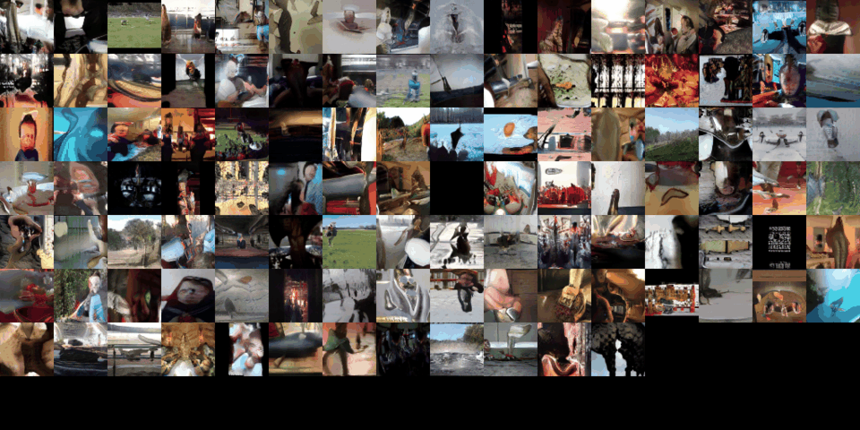

# Large Scale Video Generation

This repo is an implentation of adversarial video generation based on the model proposed in [DVD-GAN](https://arxiv.org/abs/1907.06571). The implementation extends the [BigGAN](https://arxiv.org/pdf/1809.11096.pdf) framework to a video setting by adding a video discriminator and a convolutional GRU to generate frame sequences.

Code is based on the [BigGAN Github repo](https://github.com/ajbrock/BigGAN-PyTorch). The video generation code in this repo is mainly developed by Xiaodan Du and Jugat Lamba.

## Using the Code

We trained a model on [Kinetics-400](https://deepmind.com/research/open-source/kinetics) to generate 12 frame 64x64 resolution videos. In similar fashion to the BigGAN repo, the `scripts/launch_DVDGAN_64.sh` script launches model training for a Kinetics-400 video GAN at 64x64 resolution with the hyperparameters we used.

We trained our model for around 2-3 days on 8 V100s. Example generated videos are shown below:

## Acknowledgments

This code is built on the [PyTorch BigGAN](https://github.com/ajbrock/BigGAN-PyTorch) codebase.
